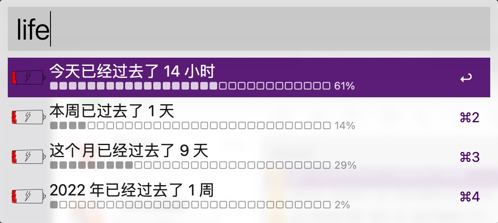
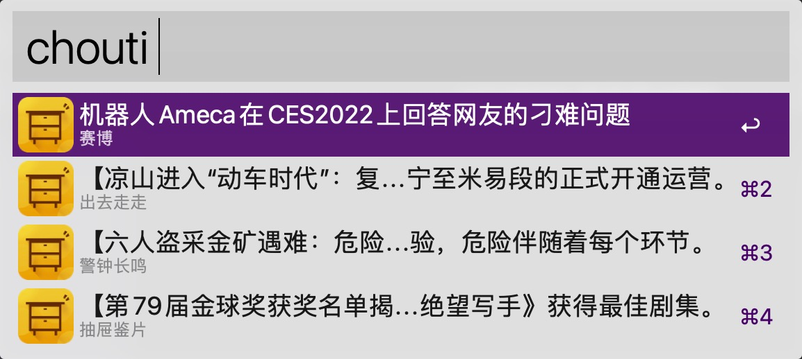

# Workflow

用swift写下Alfred workflow

## [人生进度条](https://raw.githubusercontent.com/pdso/workflow/master/life/life.alfredworkflow)

### 输入 `life`  查看进度

## [抽屉新热榜](https://raw.githubusercontent.com/pdso/workflow/master/chouti/chouti.alfredworkflow)

### 输入 `chouti`看新闻

